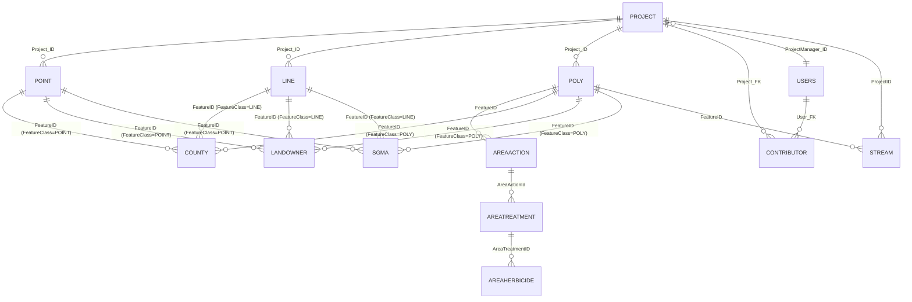

# Database Schema

This document describes the WRI SQL Server database schema as discovered during feature migration. It covers all tables known to the new app, their columns, data types, and relationships.

> **Note on table name casing:** The migrations define `AreaACTION` and `AreaTreatment` (mixed case), but application code references them as `AREAACTION` and `AREATREATMENT`. SQL Server is case-insensitive by default, so this works in practice, but the canonical names as defined in the migrations are used throughout this document.

---

## Entity Relationship Diagram



---

## Tables

### PROJECT

The top-level record for a restoration project. Stores metadata and pre-computed aggregate spatial statistics that are recalculated whenever features are created, updated, or deleted.

| Column                        | Type     | Notes                                                                                                                                                                                       |
| ----------------------------- | -------- | ------------------------------------------------------------------------------------------------------------------------------------------------------------------------------------------- |
| `Project_ID`                  | integer  | Primary key                                                                                                                                                                                 |
| `ProjectManagerName`          | string   | Display name of the project manager                                                                                                                                                         |
| `ProjectManager_ID`           | integer  | FK → `USERS.User_ID`                                                                                                                                                                        |
| `LeadAgencyOrg`               | string   |                                                                                                                                                                                             |
| `Title`                       | string   |                                                                                                                                                                                             |
| `Status`                      | string   | e.g. `Active`, `Cancelled`, `Completed`                                                                                                                                                     |
| `Description`                 | string   |                                                                                                                                                                                             |
| `ProjRegion`                  | string   |                                                                                                                                                                                             |
| `Features`                    | string   | `Yes` / `No`; controls whether features can be added; added by the `auth` migration                                                                                                         |
| `AffectedAreaSqMeters`        | string   | Pre-computed aggregate; updated by project stats query                                                                                                                                      |
| `TerrestrialSqMeters`         | string   | Pre-computed aggregate                                                                                                                                                                      |
| `AqRipSqMeters`               | string   | Pre-computed aggregate                                                                                                                                                                      |
| `EasementAcquisitionSqMeters` | string   | Pre-computed aggregate                                                                                                                                                                      |
| `StreamLnMeters`              | string   | Pre-computed aggregate (sum of `STREAM.Intersection`)                                                                                                                                       |
| `Centroid`                    | geometry | SQL Server spatial type; centroid of all features combined; updated by project stats query. **Not defined in migrations** (pre-existing prod-only column; SQLite emulator does not have it) |

---

### USERS

Stores user accounts and authentication credentials.

| Column            | Type     | Notes                                                                                |
| ----------------- | -------- | ------------------------------------------------------------------------------------ |
| `User_ID`         | integer  | Primary key                                                                          |
| `FirstName`       | string   |                                                                                      |
| `LastName`        | string   |                                                                                      |
| `Agency`          | integer  |                                                                                      |
| `JobTitle`        | string   |                                                                                      |
| `Office`          | integer  |                                                                                      |
| `OfficeAddress`   | string   |                                                                                      |
| `OfficePOBox`     | string   |                                                                                      |
| `OfficeCity`      | string   |                                                                                      |
| `OfficeState`     | string   |                                                                                      |
| `OfficeZipCode`   | integer  |                                                                                      |
| `PhoneOffice`     | string   |                                                                                      |
| `PhoneMobile`     | string   |                                                                                      |
| `Email`           | string   |                                                                                      |
| `Role`            | integer  |                                                                                      |
| `UserName`        | string   |                                                                                      |
| `umd_id`          | string   |                                                                                      |
| `user_group`      | string   | Authorization role: `GROUP_ADMIN`, `GROUP_EDITOR`, `GROUP_PUBLIC`, `GROUP_ANONYMOUS` |
| `ExpireDate`      | datetime |                                                                                      |
| `UserKey`         | string   | Used with `Token` to authenticate API calls                                          |
| `Token`           | string   | Used with `UserKey` to authenticate API calls                                        |
| `RequestedAccess` | string   |                                                                                      |
| `Active`          | string   | `YES` / `NO`                                                                         |
| `esmf_user_id`    | integer  |                                                                                      |

---

### CONTRIBUTOR

Junction table granting a user edit access to a specific project they do not own.

| Column           | Type    | Notes                        |
| ---------------- | ------- | ---------------------------- |
| `Contributor_ID` | integer | Primary key (auto-increment) |
| `Project_FK`     | integer | FK → `PROJECT.Project_ID`    |
| `User_FK`        | integer | FK → `USERS.User_ID`         |

---

## Spatial Feature Tables

There are three spatial feature tables — `POINT`, `LINE`, and `POLY` — each with a `FeatureID` primary key and a `Project_ID` foreign key back to `PROJECT`. They share a common set of descriptive columns but differ in geometry type and how actions/sub-types are stored.

### POINT

| Column                      | Type    | Notes                                                              |
| --------------------------- | ------- | ------------------------------------------------------------------ |
| `FeatureID`                 | integer | Primary key                                                        |
| `TypeDescription`           | string  | Feature category, e.g. `Guzzler`                                   |
| `Description`               | string  | Free-text comment                                                  |
| `TypeCode`                  | integer |                                                                    |
| `FeatureSubTypeID`          | integer |                                                                    |
| `FeatureSubTypeDescription` | string  | Sub-type / treatment type                                          |
| `ActionID`                  | integer |                                                                    |
| `ActionDescription`         | string  |                                                                    |
| `Project_FK`                | integer | Defined as `.unique()` in migration; appears to be a legacy column |
| `Project_ID`                | integer | FK → `PROJECT.Project_ID`                                          |
| `StatusDescription`         | string  |                                                                    |
| `StatusCode`                | integer |                                                                    |
| `Shape`                     | point   | SQL Server spatial geometry                                        |

---

### LINE

| Column                      | Type     | Notes                                                              |
| --------------------------- | -------- | ------------------------------------------------------------------ |
| `FeatureID`                 | integer  | Primary key                                                        |
| `TypeDescription`           | string   | Feature category, e.g. `Fence`                                     |
| `TypeCode`                  | integer  |                                                                    |
| `FeatureSubTypeID`          | integer  |                                                                    |
| `FeatureSubTypeDescription` | string   | Sub-type / treatment type                                          |
| `ActionID`                  | integer  |                                                                    |
| `ActionDescription`         | string   |                                                                    |
| `Description`               | string   | Free-text comment                                                  |
| `Project_FK`                | integer  | Defined as `.unique()` in migration; appears to be a legacy column |
| `Project_ID`                | integer  | FK → `PROJECT.Project_ID`                                          |
| `StatusDescription`         | string   |                                                                    |
| `StatusCode`                | integer  |                                                                    |
| `Shape`                     | geometry | SQL Server spatial geometry                                        |
| `LengthLnMeters`            | float    | Pre-computed feature length                                        |

---

### POLY

Polygon features use a separate action hierarchy (`AREAACTION` → `AREATREATMENT` → `AREAHERBICIDE`) instead of inline `ActionDescription`/`FeatureSubTypeDescription` columns.

| Column              | Type      | Notes                                               |
| ------------------- | --------- | --------------------------------------------------- |
| `FeatureID`         | integer   | Primary key                                         |
| `TypeDescription`   | string    | Feature category, e.g. `Terrestrial Treatment Area` |
| `TypeCode`          | integer   |                                                     |
| `Project_ID`        | integer   | FK → `PROJECT.Project_ID`                           |
| `StatusDescription` | string    |                                                     |
| `StatusCode`        | integer   |                                                     |
| `Shape`             | geometry  | SQL Server spatial geometry                         |
| `AreaSqMeters`      | float     | Pre-computed feature area                           |
| `Retreatment`       | string(1) | `Y` or `N`                                          |

---

## Polygon Action Hierarchy

Polygon features support multiple actions, each with multiple treatments, each with multiple herbicides. This three-level hierarchy is stored across three tables.

### AREAACTION

One row per action on a polygon feature.

| Column              | Type    | Notes                        |
| ------------------- | ------- | ---------------------------- |
| `AreaActionId`      | integer | Primary key                  |
| `FeatureID`         | integer | FK → `POLY.FeatureID`        |
| `ActionID`          | integer |                              |
| `ActionDescription` | string  | e.g. `Herbicide application` |

---

### AREATREATMENT

One row per treatment within an action.

| Column                     | Type    | Notes                          |
| -------------------------- | ------- | ------------------------------ |
| `AreaTreatmentID`          | integer | Primary key                    |
| `AreaActionID`             | integer | FK → `AREAACTION.AreaActionId` |
| `TreatmentTypeID`          | integer |                                |
| `TreatmentTypeDescription` | string  | e.g. `Aerial (helicopter)`     |

---

### AREAHERBICIDE

One row per herbicide within a treatment.

| Column                 | Type    | Notes                                |
| ---------------------- | ------- | ------------------------------------ |
| `AreaHerbicideID`      | integer | Primary key                          |
| `AreaTreatmentID`      | integer | FK → `AREATREATMENT.AreaTreatmentID` |
| `HerbicideID`          | integer |                                      |
| `HerbicideDescription` | string  | e.g. `Imazapic`                      |

---

## GIS Rollup Tables

These tables store the results of spatial intersection calculations performed when a feature is created or updated (via the SOE service in the old app). They are keyed on `(FeatureID, FeatureClass)` where `FeatureClass` is the name of the spatial table (`POLY`, `LINE`, or `POINT`), acting as a polymorphic foreign key.

### COUNTY

| Column         | Type    | Notes                                            |
| -------------- | ------- | ------------------------------------------------ |
| `COUNTY_ID`    | integer |                                                  |
| `FeatureID`    | integer | FK → `{FeatureClass}.FeatureID`                  |
| `FeatureClass` | string  | `POLY`, `LINE`, or `POINT`                       |
| `CountyInfoID` | integer |                                                  |
| `County`       | string  | County name                                      |
| `Intersection` | float   | Intersection area (sq meters) or length (meters) |

---

### LANDOWNER

| Column         | Type    | Notes                           |
| -------------- | ------- | ------------------------------- |
| `LandownerID`  | integer | Primary key                     |
| `FeatureID`    | integer | FK → `{FeatureClass}.FeatureID` |
| `FeatureClass` | string  | `POLY`, `LINE`, or `POINT`      |
| `Owner`        | string  | Land ownership entity           |
| `Admin`        | string  | Administering agency            |
| `Intersection` | float   | Intersection area/length        |

---

### SGMA

Sage Grouse Management Area intersections.

| Column         | Type    | Notes                                      |
| -------------- | ------- | ------------------------------------------ |
| `FeatureID`    | integer | Primary key (but also FK → feature tables) |
| `SGMA_ID`      | integer |                                            |
| `FeatureClass` | string  | `POLY`, `LINE`, or `POINT`                 |
| `SGMA`         | string  | SGMA name                                  |
| `Intersection` | float   | Intersection area/length                   |

---

### STREAM

Stream intersections. Unlike COUNTY/LANDOWNER/SGMA, this table is **only populated for `POLY` features** and also carries a direct `ProjectID` link (used when computing `PROJECT.StreamLnMeters`).

| Column              | Type    | Notes                        |
| ------------------- | ------- | ---------------------------- |
| `StreamId`          | integer |                              |
| `FeatureID`         | integer | FK → `POLY.FeatureID`        |
| `ProjectID`         | integer | FK → `PROJECT.Project_ID`    |
| `StreamDescription` | string  | Stream name                  |
| `Intersection`      | float   | Intersection length (meters) |

---

## Key Patterns

### Polymorphic feature reference (GIS rollup tables)

`COUNTY`, `LANDOWNER`, and `SGMA` use a `(FeatureID, FeatureClass)` composite to reference any of the three spatial tables without a dedicated FK per table. When querying or deleting rollup data, both columns must be used:

```sql
DELETE FROM COUNTY WHERE FeatureID = @id AND FeatureClass = 'POLY'
```

### Pre-computed project statistics

`PROJECT` stores pre-computed aggregates (`TerrestrialSqMeters`, `AqRipSqMeters`, etc.) and a spatial `Centroid`. These are kept in sync by running the project stats update query after any feature create, update, or delete. The update uses SQL Server spatial aggregate functions which require a live SQL Server connection (not SQLite).

### `FeatureClass` values vs table names

The `FeatureClass` string stored in rollup rows is always uppercase: `POLY`, `LINE`, `POINT` — matching the actual table names.

### `TypeDescription` case handling

`TypeDescription` values in the spatial tables are stored in mixed case (e.g. `Terrestrial Treatment Area`). All application lookups compare using `LOWER(TypeDescription)` to match against the lowercase keys used in `tableLookup` in `utils.ts`.
